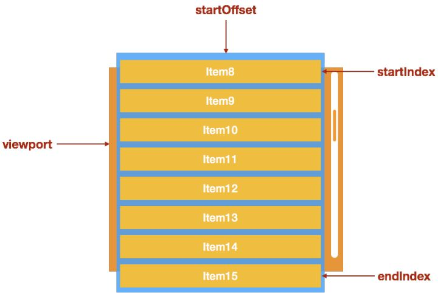

# 前端性能优化

## 一.动画性能优化

目前实现动画的主要三种方式：

* Canvas
* CSS3
* DOM

DOM+js这种方式由于极易引起浏览器重绘或者回流，有非常大的性能风险，对于这种动画的优化方法就是不用DOM操作进行动画操作

### 1.CSS3动画优化

先了解几个CSS3动画的几个概念

#### 图层

浏览器在渲染一个页面时，会将页面分为很多个图层，图层有大有小，每个图层上有一个或多个节点。在渲染DOM的时候，浏览器所做的工作实际上是：

* 获取DOM后分割为多个图层
* 对每个图层的节点计算样式结果（Recalculate style -- 样式重计算）
* 为每个节点生成图形和位置（Layout -- 回流和重布局）
* 将每个节点绘制填充到图层位图中(Paint Setup 和Paint-重绘)
* 图层作为纹理上传至GPU
* 符合多个图层到页面上生成最终屏幕图像（compositeLayers--图层重组）

#### 回流

一些常用的改变时会触发重新布局的属性：
&nbsp;
盒子模型相关属性会触发重布局

* width
* height
* padding
* margin
* display
* border-width
* border
* min-height

定位属性及浮动也会触发重布局

* top
* bottom
* left
* right
* position
* float
* clear

改变节点内部文字结构也会触发重布局

* text-align
* overflow-y
* font-weight
* overflow
* font-family
* line-height
* vertical-align
* white-space
* font-size

#### 重绘

导致重绘的属性（不改变节点的位置及大小）：

* color
* border-style
* border-radius
* visibility
* text-decoration
* background
* background-image
* background-position
* background-repeat
* background-size
* outline-color
* outline
* outline-stype
* box-shadow

#### CSS3动画优化

CSS动画优化遵守以下原则：

* 尽量将动画放在一个独立图层，这样可以避免动画效果影响其他渲染层的动画
* 尽量避免回流和重绘
* 尽量使用GPU，速度更快

因此，需要创建独立的合成层：

* 硬件加速的iframe元素（比如iframe嵌入的页面中有合成层）
* video 元素
* 覆盖在video元素上的视频控制栏
* 3D或者硬件加速的2D Canvas元素 （普通2DCanvas不会提升为合成层，3D Canvas提升为合成层）
* 硬件加速的插件，比如flash等
* 在DPI较高的屏幕上，fix定位的元素会自动的被提升到合成层中，但在DPI较低的设备上，渲染层的提升会使得字体渲染方式由子像素变为灰阶
* 有3D transform
* **对opacity，transform，filter，backdropfilter应用了animation或者transition（需要是active的animation或者transition，当animation或者transition效果未开始或结束后，提升合成层也会失效）**
* **will-change设置为opacity,transform,top,left,bottom,right(其中top，left等需要设置明确的定位属性，如relative等)**

#### 如何避免重绘和回流

多使用transform或者opacity来实现动画效果

#### 如何利用GPU加速

以下几个属性会获得GPU加速

* opacity
* translate
* rotate
* scale

### 2.Canvas动画优化

几种比较主流的优化方法

#### 1)requestAnimationFrame

requestAnimationFrame对比setInterval

* 性能更好：优点是它能够将所有的动画都放到一个浏览器重绘周期里去做，这样能保证CPU循环次数，提供性能
* 开销更小：requestAnimationFrame是由浏览器专门为动画提供API，在运行时浏览器会自动优化方法的调用，并且如果页面不是激活状态下的话，动画会自动暂停，有效节省了CPU开销

#### 2)离屏Canvas

离屏渲染是将离屏canvas当做一个缓存区，把需要重复绘制的画面数据进行缓存起来，减少调用canvas的API的消耗：

* 1.创建离屏canvas
* 2.设置离屏canvas的宽高
* 3.在离屏canvas中进行绘制
* 4.在离屏canvas的全部或部分绘制到正在显示的canvas上

#### 3)避免浮点运算

利用canvas进行动画绘制时，如果计算出来的坐标是浮点数，可能会出现CSS Sub-pixel的问题，也就是会自动将浮点数值四舍五入转为整数，那么在动画的过程中，由于元素运动的轨迹并不是严格按照计算公式得到，那么就可能出现抖动的情况，同时也可能让元素的边缘出现抗锯齿失真，这也是可能影响性能的一方面，因为一直在做不必要的取证运算

#### 4)减少调用Canvas API

canvas也是通过操纵js来绘制的，但是相比正常的js操作，调用canvasAPI将更加消耗资源，所以在绘制之前请做好规划，通过适量js原生计算减少canvas API的调用是一件比较划算的事情  
比如：做粒子效果时，尽量少用圆，最好是用方形，因为粒子太小，所以方形看上去也跟圆差不多，至于原因，很容易理解，我们画一个圆需要步骤：先beginPath，然后用arc画弧，再用fill进行填充才能产生一个圆，但画方形，只需要一个fillRect就可以了，瑞然只是相差两个调用，当粒子对象数量达到一定时，这性能差距就会显示出来了

#### 5)web worker

在进行某些耗时操作时，例如计算大量数据，一桢中包含了太多的绘制状态，大规模的DOM操作等，可能会导致页面卡顿，影响用户体验  
web worker最常用的场景就是大量频繁的计算，减轻主线程压力，如果遇到大规模的计算，可以通过此API分担主线程压力

## 二.大量数据性能优化

### 1.虚拟列表

常见的场景：前端需要渲染大量数据（数千数万行数据）而且会允许分页，这种情况下网页会出现掉帧，卡顿甚至假死的情况，通常使用虚拟列表来解决此问题  
&nbsp;
因为DOM元素的创建和渲染需要的时间成本很高，在大数据的情况下，完整渲染列表所需要的时间不可接受。其中一个解决思路就是在任何情况下只对‘可见区域’进行渲染，可以达到极高的初次渲染性能
&nbsp;
虚拟列表指的是‘可视区域渲染’的列表，最重要的是两个概念：
&nbsp;
可滚动区域：假设有1000条数据，每个列表项的高度是30，那么可滚动的区域的高度就是1000*30，当用户改变列表的滚动条的当前滚动值的时候，会造成可见区域的内容的变更
可见区域：比如列表的高度是300，右侧有纵向滚动条可以滚动，那么视觉可见的区域就是可见区域，实现虚拟列表就是处理滚动条后的可见区域的变更，其中具体步骤如下：

* 计算当前可见区域起始数据的startIndex
* 计算当前可见区域结束数据的endIndex
* 计算当前可见区域的数据，并渲染到页面中
* 计算startIndex对应的数据在整个列表中的偏移位置startOffset，并设置到列表上

[虚拟列表](https://zhuanlan.zhihu.com/p/34585166)